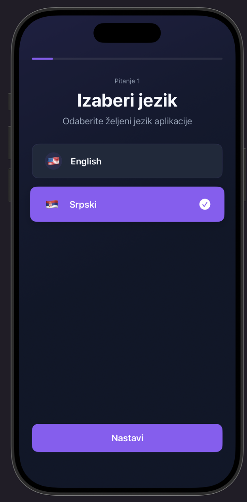
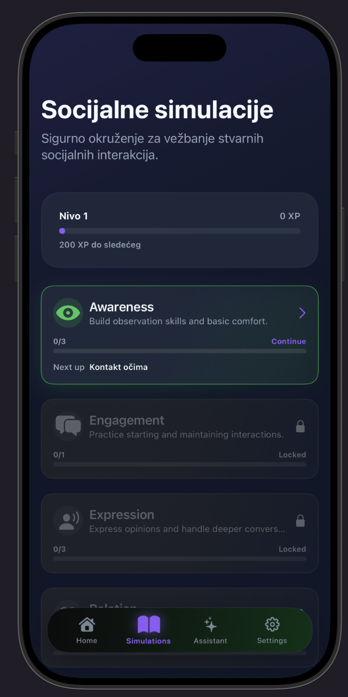

## OutZone

**Out of Comfort** is an interactive **iOS application built with SwiftUI** designed to help users step outside their **social comfort zone**, improve communication skills, and build confidence in everyday social situations.

The app combines **daily challenges, progress tracking, an AI assistant, and gamification** to motivate users to actively engage in new social interactions in a safe and structured way.

---

## 🎯 Purpose of the App

The goal of this application is to:
- Encourage users to **engage in real-life social interactions**
- Build **confidence and communication skills**
- Promote **initiative, individuality, and courage**
- Highlight the importance of **connection, collaboration, and social presence**

The app focuses on **real-world applicability**, making self-improvement achievable through small, consistent actions.

---

## 🎬 Demo Video

This video shows the main features of the app, including onboarding, core functionality, and UI flow.

Watch here: https://vimeo.com/1165220091?share=copy&fl=sv&fe=ci

## 📸 Screenshots

  
  
  

 

  
  
  

 

## ✨ Key Features

### 🎯 Social Challenges
- Daily and weekly social challenges
- Examples:
  - Start a conversation with a new person
  - Give a genuine compliment
  - Ask a question in class or at work
  - Join a group activity or discussion
- Challenges scale in difficulty as confidence improves

---

### 🧠 AI Assistant
- Built-in AI assistant for guidance and motivation
- Helps users:
  - Prepare for social situations
  - Reflect on completed challenges
  - Receive personalized advice
- Adaptive responses based on user progress

---

### 🏁 Onboarding Experience
- Smooth onboarding flow
- Users select:
  - Confidence level
  - Preferred challenge style
  - Personal goals
- App customizes challenges from the first session

---

### 📊 Progress Tracking
- Confidence improvement scale
- Daily and weekly activity tracking
- Visual progress indicators
- Personal growth history

---

### 🏆 Gamification System
- Score-based improvement system
- Achievement badges for milestones
- Rewards for consistency and initiative
- Encourages long-term engagement

---

### 👤 User Profile
- Personalized user dashboard
- Displays:
  - Progress level
  - Earned badges
  - Completed challenges
- Editable preferences and goals

---

### 🌍 Multilingual Support
- Multiple language support
- Designed for inclusivity and accessibility
- Language can be changed at any time

---

### 🎨 Custom Challenge Styles
- Users can choose different challenge styles:
  - Gentle & beginner-friendly
  - Balanced & progressive
  - Bold & confidence-boosting
- Allows users to grow at their own pace

---

## 🛠 Technical Stack

- **Language:** Swift  
- **Framework:** SwiftUI  
- **Architecture:** MVVM  
- **State Management:** @State / @Observable / @Environment  
- **AI Integration:** OpenAI API  
- **Persistence:** Local storage / Cloud backend  
- **Localization:** Multi-language support  

---

## 🧱 Architecture

The application follows **MVVM architecture**, ensuring:
- Clear separation of UI and business logic
- Scalable and maintainable codebase
- Testable and modular components

---

## 📱 Ease of Use

- Minimalist and intuitive UI
- Clear call-to-action buttons
- Designed for fast daily interactions (1–5 minutes)
- Accessible for users of all ages

---

## 📌 Practical Application

This app can be used in:
- Schools and universities
- Personal development programs
- Team-building environments
- Therapy and coaching support tools

---

## 🚀 Getting Started

### Requirements
- iOS 16+
- Xcode 15+
